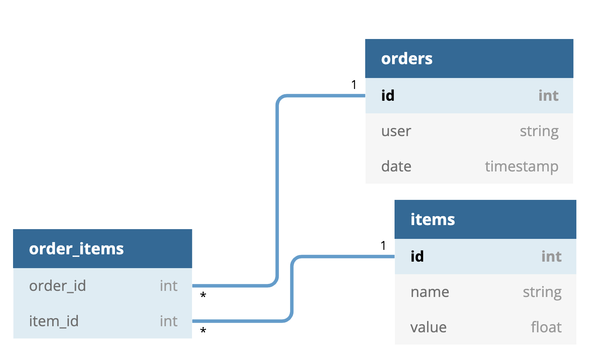
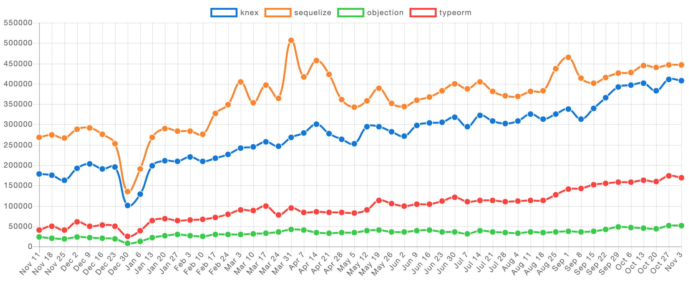
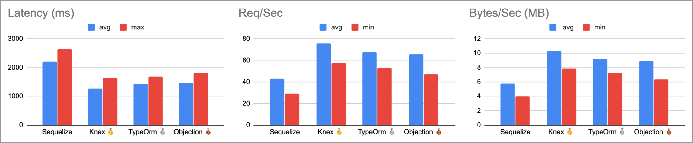
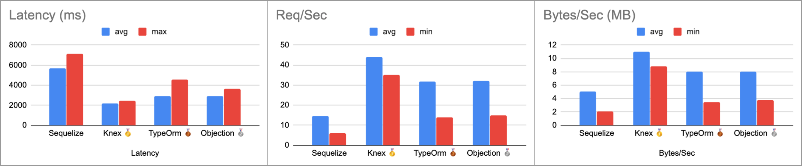
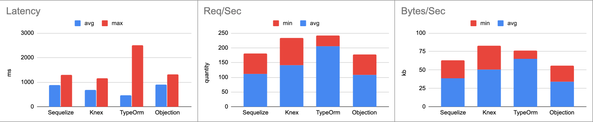

# ORM research for TypeScript Node.js applications


## Table of contents

* [Introduction](#introduction)
  + [Important concepts](#important-concepts)
  + [Which libraries are we going to analize?](#which-libraries-are-we-going-to-analize)
* [Case study](#case-study)
  + [Database schema](#database-schema)
  + [Endpoints](#endpoints)
* [Results](#results)
  + [Community](#community)
  + [Documentation](#documentation)
  + [TypeScript integration](#typescript-integration)
  + [Performance](#performance)
* [Developing](#developing)
  + [Database configuration](#database-configuration)
  + [Migrations](#migrations)
  + [Starting app](#starting-app)
  + [Debugging](#debugging)
* [License](#license)


## Introduction

This research research motivation is to provide a global and objective vision about most used Node.js ORMs in market.

This document does not try to declare which is the best but instead describes their characteristics, features, performance, pros and cons, implementation, and so.

### Important concepts

#### What is an ORM?

When people talk about ORMs, they usually make reference to a library that implements the Object-Relational Mapping (ORM) technique. It is a completely ordinary library written in your language of choice that encapsulates the code needed to manipulate the data in your database, so you don't use SQL anymore; you interact directly with an interface in the same language you're using.

You can find a great explanation in the following link from [StackOverflow](https://stackoverflow.com/questions/1279613/what-is-an-orm-how-does-it-work-and-how-should-i-use-one).

#### What is a Query Builder?

As it name clames, a query builder is an interface that allows you to writte SQL in your prefered language. Main difference with ORMs is that you don't have to define models strucutre for a query builder because you are not working with objects that represents your data.

### Which libraries are we going to analize?

For this reasearch we are going to consider following ORMs:

- [Sequelize](https://sequelize.org/): It features solid transaction support, relations, eager and lazy loading, read replication and more. It is one of the most complete ORMs for Node.js. It supports: Postgres, MySQL, MariaDB, SQLite and Microsoft SQL Server.
- [Knex](http://knexjs.org/): It's a very powerfull query builder with transactions support. It hasn't all features an ORM may has but its performance its quite better. Postgres, MSSQL, MySQL, MariaDB, SQLite3, Oracle, and Amazon Redshift.
- [TypeORM](https://typeorm.io/#/): Its goal is to always support the latest JavaScript features and provide additional features that help you to develop any kind of application that uses databases. It supports MySQL, MariaDB, Postgres, CockroachDB, SQLite, Microsoft SQL Server, Oracle and [MongoDB NoSQL](https://github.com/typeorm/typeorm/blob/master/docs/active-record-data-mapper.md).
- [Objection](https://vincit.github.io/objection.js/): It's build on Knex, thus supports same databases. It has all the benefits of an SQL query builder but also a powerful set of tools for working with relations, for this it can be considered an ORM.


## Case study

### Database schema

For the research, we've created a simple database schema with a Many-to-many relation. This schema allows to test libraries features, performance and code quality while keeping examples simple. We are going to work with [Postgres](https://www.postgresql.org/) as relational database.



```
Table orders {
  id int [pk]
  user string
  date timestamp
}

Table items {
  id int [pk]
  name string
  value float
}

Table order_items {
  order_id int [ref: > orders.id]
  item_id int [ref: > items.id]
}

```

### Endpoints

To tests libraries implementation we created the following endpoints with [Express.js](https://expressjs.com/).

```
GET /<orm_name>/orders # Get all orders with their items
POST /<orm_name>/orders # Create many orders with their items
```

The key in this endpoints is we are managing nested resources. An order has one or many items, and payload has them nested into order.


## Results

### Community

First, we can look at NPM packages and their metrics to have a clear image about how much they are being used.

<table width="100%" align="center">
  <tr>
    <th>Library</th>
    <th>Creation date</th> 
    <th>Weekly downloads</th> 
    <th>Dependents</th> 
  </tr>
  <tr align="center">
    <td>
      <a link="https://www.npmjs.com/package/sequelize" target="blank">Sequelize</a>
    </td>
    <td>Jul 22, 2010</td>
    <td>446,312</td>
    <td>3,139</td>
  </tr>
  <tr align="center">
    <td>
      <a link="https://www.npmjs.com/package/knex" target="blank">Knex</a>
    </td>
    <td>Dec 29, 2012</td>
    <td>410,065</td>
    <td>1,953</td>
  </tr>
  <tr align="center">
    <td>
      <a link="https://www.npmjs.com/package/typeorm" target="blank">TypeORM</a>
    </td>
    <td>Feb 29, 2016</td>
    <td>168,470</td>
    <td>917</td>
  </tr>
  <tr align="center">
    <td>
      <a link="https://www.npmjs.com/package/objection" target="blank">Objection</a>
    </td>
    <td>Apr 14, 2015</td>
    <td>49,842</td>
    <td>220</td>
  </tr>
</table>

<p align="left">
  
</p>

In this category, Sequelize seems to be a clear winner. It has been in the game for a longer time and its community doesn't stop growing. It's interesting how Knex is almost as used as Sequelize despite being a less friendly solution. Besides both packages duplicated their weekly downloads in this year.

Objection, in the other side, shows an almost null downloads increase keeping around 50K downloads per week.

Finally, in the last year TypeORM has triplicated its downloads. Despite staying still well below Sequelize and Knex it is positioning itself as an interesting competitor.

**You can find an updated analisys about npm packages on [NPM Trends](https://www.npmtrends.com/knex-vs-sequelize-vs-objection-vs-typeorm) 🔗**.

<p  align="center">• • •</p>

### Documentation

- **Implementation**: Provides a "Getting started" guide, with examples and steps explanations about how to implement the library in my project.
- **Recipes**: Provides examples about how to implement solutions for different case uses (ie: relations).
- **Real-world examples**: Provides real-world examples, with implementations in differents frameworks.
- **Straightforward**: Easy to find needed information and read, updated and clear.
- **TypeScript**: Provides documentation about TypeScript support, with examples and explanations about best practices.

<table width="100%" align="center">
  <tr>
    <th>Library</th>
    <th>Implementation</th> 
    <th>Recipes</th> 
    <th>Real-world examples</th>
    <th>Straightforward</th>
    <th>TypeScript</th>
  </tr>
  <tr align="center">
    <td>
      <a link="https://sequelize.org/v5/manual/getting-started.html" target="blank">Sequelize</a>
    </td>
    <td>✅</td>
    <td>✅</td>
    <td>❌</td>
    <td>❌</td>
    <td>⚠️</td>
  </tr>
  <tr align="center">
    <td>
      <a link="http://knexjs.org/" target="blank">Knex</a>
    </td>
    <td>✅</td>
    <td>❌</td>
    <td>❌</td>
    <td>✅</td>
    <td>⚠️</td>
  </tr>
  <tr align="center">
    <td>
      <a link="https://typeorm.io/#/" target="blank">TypeORM</a>
    </td>
    <td>✅</td>
    <td>✅</td>
    <td>✅</td>
    <td>✅</td>
    <td>✅</td>
  </tr>
  <tr align="center">
    <td>
      <a link="https://vincit.github.io/objection.js/guide/" target="blank">Objection</a>
    </td>
    <td>✅</td>
    <td>✅</td>
    <td>✅</td>
    <td>✅</td>
    <td>✅</td>
  </tr>
</table>

Either Sequelize and Knex provide TypeScript documentation, it is not enough to implement a clean solution in our projects and requires more research.

<p  align="center">• • •</p>

### TypeScript integration

All analized libraries expose their own types we can use, but not all has a great integration with TypeScript and developing experience could be a little bit rough with some of them.

#### Sequelize 👎

Quoting it's [own documentation](https://sequelize.org/master/manual/typescript.html): _"As Sequelize heavily relies on runtime property assignments, TypeScript won't be very useful out of the box. A decent amount of manual type declarations are needed to make models workable."_. Working with Sequelize and TypeScript could be a really bad experience when you are starting with typing in JavaScript. You have to do a lot of manual work to define your models and made them work in strict mode.

Relationships are hard with Sequelize and TypeScript. You’ll need to add a set of mixin functions for every single [association](https://sequelize.org/master/manual/associations.html) you create and on both the models involved in the association. If you want to know more about this, you can read [this article which explains how to setup Sequelize with TypeScript](https://vivacitylabs.com/setup-typescript-sequelize/).

Moreover, when you start deep inside sequelize functionality you will notice many optional properties you can pass some functions are not typed! For example, when you use `bulkCreate` optional property `include` (which should be defined on `BulkCreateOptions` interface) is not created so you have to extend Sequelize type definitions yourself in order to use it.

#### Knex 👍

Remember Knex is just a query builder, so we don't define entities, models or any other object that represents our table data. For this reason, we need to create interfaces for our inputs and outputs. Besides that, **integration between TypeScript and Knex is acceptable**.

#### TypeORM 🏆

TypeORM, name already gives us a hint, **is a perfect partner for TypeScript** and is the one that exploits the most its capabilities. It allows you to write only one TypeScript Class and automatically generates all structure for your entity.

Code complexity and quantity are greatly reduced, thus our entities definitions are much more cleaner than, for example, Sequelize. 

Decorators can seem to be strange at first sight, especially if you've never implement this concept before, but once you get used to them they are very easy to use.

#### Objection 🏆

Another **great TypeScript partner**, integration is surprisingly simple and intuitive. You define your models and Objection automatically generates all structure you need to use them. Models definition are very clean and use them is very straightforward.

Documentation is very simple and usefull and you have [real-world examples as guide](https://github.com/Vincit/objection.js/blob/master/examples/express-ts/).

Besides, it could be a good alternative if you want to avoid using TypeORM decorators syntax, and keep a more conservative sintax.

<p  align="center">• • •</p>

### Performance

[autocannon](https://github.com/mcollina/autocannon) is a fast HTTP/1.1 benchmarking tool written in Node.js. All examples used are benchmarked using these options:

```bash
# <orm> = knex|typeorm|sequelize|objection

autocannon -c 100 -d 20 -m "GET" "localhost:8080/<orm>/orders"

autocannon -c 100 -d 20 -m "POST" "localhost:8080/<orm>/orders" -i "./data.json" -H "Content-Type: application/json"
```

- `-c` The number of concurrent connections to use.
- `-d` The number of pipelined requests to use.
- `-m` The method of the requests.
- `-i` File path for request body.
- `-H` Headers definitions.

Test Bench Configuration:

- **OS**: macOs Catalina 10.15.1.
- **CPU**: 2,2 GHz Quad-Core Intel Core i7.
- **RAM**: 16 GB 1600 MHz DDR3.
- **Node version**: v10.17.0.

#### GET simple

<table>
  <tr>
    <th>Library</th>
    <th>Latency avg</th>
    <th>Latency max</th>
    <th>Req/Sec avg</th>
    <th>Req/Sec min</th>
    <th>Bytes/Sec avg</th>
    <th>Bytes/Sec min</th>
  </tr>
  <tr align="center">
    <td>
      <a>Sequelize</a>
    </td>
    <td>2201.91 ms</td>
    <td>2647.18 ms</td>
    <td>42.9</td>
    <td>29</td>
    <td>5.83 MB</td>
    <td>3.94 MB</td>
  </tr>
  <tr align="center">
    <td>
      <a>Knex 🥇</a>
    </td>
    <td>1276.52 ms ms</td>
    <td>1647.52 ms</td>
    <td>75.91</td>
    <td>58</td>
    <td>10.3 MB</td>
    <td>7.88 MB</td>
  </tr>
  <tr align="center">
    <td>
      <a>TypeORM 🥈</a>
    </td>
    <td>1423.56 ms</td>
    <td>1685.29 ms</td>
    <td>67.8</td>
    <td>53</td>
    <td>9.21 MB</td>
    <td>7.2 MB</td>
  </tr>
  <tr align="center">
    <td>
      <a>Objection 🥉</a>
    </td>
    <td>1466.76 ms</td>
    <td>1808.73 ms</td>
    <td>65.66</td>
    <td>47</td>
    <td>8.92 MB</td>
    <td>6.39 MB</td>
  </tr>
</table>

<p align="center">
  
</p>

#### GET nested object

<table>
  <tr>
    <th>Library</th>
    <th>Latency avg</th>
    <th>Latency max</th>
    <th>Req/Sec avg</th>
    <th>Req/Sec min</th>
    <th>Bytes/Sec avg</th>
    <th>Bytes/Sec min</th>
  </tr>
  <tr align="center">
    <td>
      <a>Sequelize</a>
    </td>
    <td>5697.71 ms</td>
    <td>7124.39 ms</td>
    <td>14.75</td>
    <td>6</td>
    <td>5.1 MB</td>
    <td>2.07 MB</td>
  </tr>
  <tr align="center">
    <td>
      <a>Knex 🥇</a>
    </td>
    <td>2156.48 ms</td>
    <td>2471.32 ms</td>
    <td>43.9</td>
    <td>35</td>
    <td>11 MB</td>
    <td>8.8 MB</td>
  </tr>
  <tr align="center">
    <td>
      <a>TypeORM 🥉</a>
    </td>
    <td>2917.68 ms</td>
    <td>4586.61 ms</td>
    <td>31.9</td>
    <td>14</td>
    <td>8.02 MB</td>
    <td>3.52 MB</td>
  </tr>
  <tr align="center">
    <td>
      <a>Objection 🥈</a>
    </td>
    <td>2902.18 ms</td>
    <td>3672.11 ms</td>
    <td>32.1</td>
    <td>15</td>
    <td>8.07 MB</td>
    <td>3.77 MB</td>
  </tr>
</table>

<p align="center">
  
</p>

#### POST nested object

<table>
  <tr>
    <th>Library</th>
    <th>Latency avg</th>
    <th>Latency max</th>
    <th>Req/Sec avg</th>
    <th>Req/Sec min</th>
    <th>Bytes/Sec avg</th>
    <th>Bytes/Sec min</th>
  </tr>
  <tr align="center">
    <td>
      <a>Sequelize 🥉</a>
    </td>
    <td>882.75 ms</td>
    <td>1304.18 ms</td>
    <td>111.2</td>
    <td>70</td>
    <td>38.9 kB</td>
    <td>24.3 kB</td>
  </tr>
  <tr align="center">
    <td>
      <a>Knex 🥈</a>
    </td>
    <td>693.45 ms</td>
    <td>1166.97 ms</td>
    <td>141.95</td>
    <td>91</td>
    <td>50.4 kB</td>
    <td>32.2 kB</td>
  </tr>
  <tr align="center">
    <td>
      <a>TypeORM 🥇</a>
    </td>
    <td>477.26 ms</td>
    <td>2507.41 ms</td>
    <td>205.95</td>
    <td>36</td>
    <td>65.2 kB</td>
    <td>11.2 kB</td>
  </tr>
  <tr align="center">
    <td>
      <a>Objection</a>
    </td>
    <td>906.97 ms</td>
    <td>1322.14 ms</td>
    <td>108</td>
    <td>70</td>
    <td>34.1 kB</td>
    <td>21.9 kB</td>
  </tr>
</table>

<p align="center">
  
</p>


## Developing

### Database configuration

Before running the app, make sure you have [Postgresql installed](https://www.digitalocean.com/community/tutorials/how-to-install-and-use-postgresql-on-ubuntu-14-04) installed.

You need to create project database manually, to create it run the following steps inside a psql terminal:

1. `CREATE DATABASE db_project_name;`
2. `\c db_project_name`
3. `CREATE ROLE "project_name" LOGIN CREATEDB PASSWORD 'project_name';`

Don't forget to create a dotenv file for environment variables. `Dotenv` is used for managing environment variables. They must be stored in a `/.env` file. File structure is described above:

```
DB_HOST=localhost
DB_PORT=5432
DB_USERNAME=project_name
DB_PASSWORD=project_name
DB_NAME=db_project_name
```

### Migrations

You need to run migrations before start app. To do it simply run `npm run migrate`.

### Starting app

Run in your terminal: `npm start`.

### Debugging

In order to debug our Node.js application, we enable 'sourceMap' in `tsconfig.json`, this compiler option generates corresponding `.map` files from original Javascipt counterpart. This change is mandatory to attach a debugger, otherwise it wouldn't be able to match transpiled files with their originals.

In VSCode, you will need to add an `./.vscode/launch.json` file in order to launch the debugger. You can use the following:

```json
{
  // Use IntelliSense to learn about possible attributes.
  // Hover to view descriptions of existing attributes.
  // For more information, visit: https://go.microsoft.com/fwlink/?linkid=830387
  "version": "0.2.0",
  "configurations": [
    {
      "type": "node",
      "request": "launch",
      "name": "Launch Program",
      "program": "${workspaceFolder}/server.ts",
      "preLaunchTask": "tsc: build - tsconfig.json",
      "internalConsoleOptions": "neverOpen",
      "console": "integratedTerminal",
      "disableOptimisticBPs": true,
      "outFiles": ["${workspaceFolder}/dist/**/*.js"]
    }
  ]
}
```

## License

This project is written and maintained by [Emanuel Casco](https://github.com/emanuelcasco) and is available under the MIT [license](LICENSE.md).

    Copyright (c) 2019 Emanuel Casco

    Permission is hereby granted, free of charge, to any person obtaining a copy
    of this software and associated documentation files (the "Software"), to deal
    in the Software without restriction, including without limitation the rights
    to use, copy, modify, merge, publish, distribute, sublicense, and/or sell
    copies of the Software, and to permit persons to whom the Software is
    furnished to do so, subject to the following conditions:

    The above copyright notice and this permission notice shall be included in
    all copies or substantial portions of the Software.

    THE SOFTWARE IS PROVIDED "AS IS", WITHOUT WARRANTY OF ANY KIND, EXPRESS OR
    IMPLIED, INCLUDING BUT NOT LIMITED TO THE WARRANTIES OF MERCHANTABILITY,
    FITNESS FOR A PARTICULAR PURPOSE AND NONINFRINGEMENT. IN NO EVENT SHALL THE
    AUTHORS OR COPYRIGHT HOLDERS BE LIABLE FOR ANY CLAIM, DAMAGES OR OTHER
    LIABILITY, WHETHER IN AN ACTION OF CONTRACT, TORT OR OTHERWISE, ARISING FROM,
    OUT OF OR IN CONNECTION WITH THE SOFTWARE OR THE USE OR OTHER DEALINGS IN
    THE SOFTWARE.
